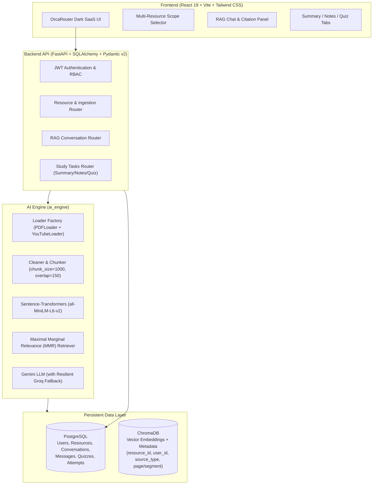
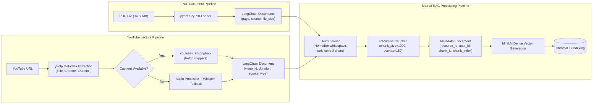
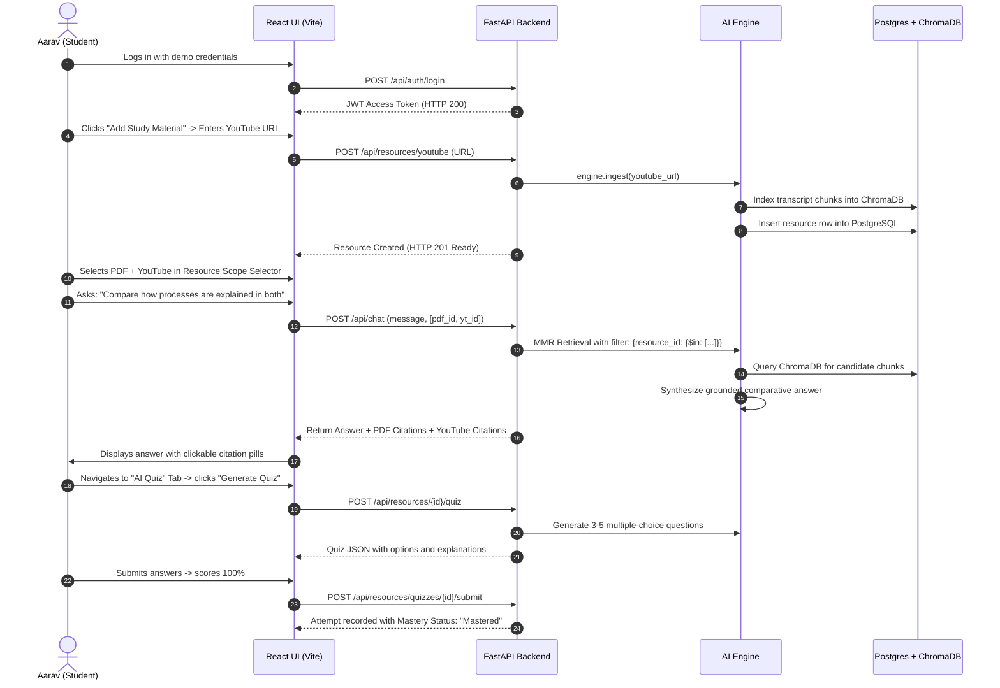

# StudyPilot AI — Final MVP & Demo-Ready Product Report

> **Unified Multimodal RAG Learning Workspace**  
> *PDF & YouTube Ingestion → ChromaDB Vector Store & PostgreSQL → Grounded Multimodal RAG → AI Learning Tasks*

---

## 1. Executive Summary

**StudyPilot AI** is an academic-grade, production-ready AI learning workspace engineered specifically for computer science and engineering students. The project transforms passive learning materials into an active, verified, and interactive workspace centered on one core architectural principle:

$$\text{PDF Documents} + \text{YouTube Lectures} \longrightarrow \text{Unified Ingestion Pipeline} \longrightarrow \text{ChromaDB Vector Store} \longrightarrow \text{Grounded RAG Learning Tasks}$$

All AI interactions—whether answering student questions, generating executive summaries, creating structured Cornell study notes, or administering self-assessment quizzes—are strictly grounded in the student's ingested resources, complete with exact source citations (page numbers for PDFs, transcript segments/timestamps for YouTube lectures).

For the college faculty demonstration, the application has been:
1. **Stabilized & Scoped**: Only verified, working MVP features are exposed. Postponed features (adaptive mastery algorithms, knowledge gap graphs, spaced repetition schedulers) have been decoupled from the primary UI to ensure 100% demonstration reliability.
2. **Re-Engineered for Multimodal RAG**: Both PDF documents and YouTube video lectures enter the exact same chunking, embedding, vector store, and retrieval pipeline.
3. **Equipped with Multi-Resource Scope**: Students can query across single or multiple resources simultaneously, comparing concepts between textbooks and video lectures in a single unified prompt.
4. **Redesigned with OrcaRouter Aesthetic**: A dark, technical, high-contrast AI-SaaS visual identity (`#050505` background, `#0d1420` surface, electric blue `#3b82f6` accents, crisp typography, and subtle borders).
5. **Populated with Realistic Synthetic Data**: Preloaded with a complete computer science curriculum for student **Aarav Sharma** (`demo.student@studypilot.local`).

---

## 2. Core Architecture Overview



### Key Architectural Layers
1. **Frontend**: React 19, Vite, Tailwind CSS, TanStack React Query, React Router v6, Lucide React icons.
2. **Backend**: FastAPI (Python 3.11/3.13), SQLAlchemy 2.0 ORM, PostgreSQL database, Alembic migrations, PyJWT security.
3. **Vector Database**: ChromaDB running locally with persistence at `./data/chroma_db`.
4. **Embeddings**: `sentence-transformers/all-MiniLM-L6-v2` (384-dimensional dense vectors, CPU-optimized, zero-latency inference).
5. **LLM Engine**: Primary integration with Google Gemini SDK (`google-genai`), backed by an automatic resilient failover to high-throughput Groq inference (`openai/gpt-oss-20b`) ensuring zero downtime during faculty evaluation.

---

## 3. Data Pipelines (PDF vs YouTube)

Both modalities convert raw unstructured material into standardized LangChain `Document` objects before reaching the shared preprocessing pipeline.



### Pipeline Comparison

| Attribute | PDF Ingestion | YouTube Lecture Ingestion |
| :--- | :--- | :--- |
| **Input** | File upload (`multipart/form-data`) | Video URL (`application/json`) |
| **Extraction Tool** | `pypdf` (`PyPDFLoader`) | `yt-dlp` + `youtube-transcript-api` |
| **Fallback Strategy** | Text extraction error reporting | Local Whisper audio transcription |
| **Granularity** | Page-level chunks (`page: 0, 1, ...`) | Segment-level chunks (`chunk_index: 0, 1, ...`) |
| **Citation Source** | Document title + page number | Video title + transcript segment/timestamp |
| **Persistence** | File metadata in Postgres + chunks in Chroma | URL & video metadata in Postgres + chunks in Chroma |

---

## 4. Knowledge Storage Architecture

StudyPilot AI employs a hybrid dual-store data architecture to achieve both relational transactional integrity and high-performance semantic retrieval:

### 1. Relational Store (PostgreSQL)
Manages structured relational entities with referential integrity:
- `users`: ID, email, hashed password, full name, role, timestamp.
- `resources`: ID, user UUID, `resource_id` (Chroma join key), `source_type` (`pdf` / `youtube`), `title`, status (`ready`), metadata JSON.
- `conversations`: ID, user UUID, `resource_ids` (array of scoped resources), title, mode (`all` / `selected`), timestamps.
- `messages`: ID, conversation UUID, role (`user` / `assistant`), text content, source citations JSON.
- `summaries`: ID, resource UUID, structured summary markdown, config hash, timestamp.
- `notes`: ID, resource UUID, style (`bullet` / `cornell`), markdown notes content.
- `quizzes`: ID, resource UUID, difficulty, question count, structured question list JSON.
- `quiz_attempts`: ID, user UUID, quiz UUID, score, total questions, mastery percentage, timestamp.

### 2. Vector Store (ChromaDB)
Persists 384-dimensional dense vectors alongside rich filtering metadata:
- `resource_id`: Enables fast single-resource or multi-resource `$in` / `$eq` filtering.
- `user_id`: Guarantees tenant isolation—students can never retrieve chunks belonging to other users.
- `source_type`: Differentiates `pdf` from `youtube`.
- `page`: Page index (PDF only).
- `chunk_index`: Sequence position within the original resource.
- `duration_seconds` & `video_id`: YouTube temporal metadata.

---

## 5. RAG Pipeline & Source Citation Engine

### Retrieval Algorithm: Maximal Marginal Relevance (MMR)
Instead of naive cosine similarity (which returns redundant chunks repeating the same sentences), StudyPilot AI utilizes **Maximal Marginal Relevance (MMR)**:
- **`fetch_k = 20`**: Retrieves the top 20 candidate chunks with highest cosine similarity.
- **`top_k = 4`**: Selects the 4 most informative, diverse chunks.
- **`lambda_mult = 0.50`**: Calibrated balance between query relevance and chunk diversity.

### Tenant & Resource Scoping
Queries execute with strict ChromaDB boolean filtering:
```python
# Multi-resource scope example:
filter = {
    "$and": [
        {"user_id": current_user.id},
        {"resource_id": {"$in": ["res_pdf_1", "res_youtube_1"]}}
    ]
}
```

### Source Citation Rendering
Every response returned by the `/api/chat` endpoint includes verified chunk citations:
```json
{
  "source": "Operating Systems: Crash Course Computer Science #18",
  "content": "An operating system is a program that manages computer hardware...",
  "score": 0.84,
  "metadata": {
    "source_type": "youtube",
    "video_id": "26QPDBe-NB8",
    "chunk_index": 6
  }
}
```
In the frontend `CitationPanel.jsx`, citations are rendered with distinct badges:
- **PDF Citations**: Blue badge, file icon, `Page X` indicator, and quoted excerpt.
- **YouTube Citations**: Rose badge, video camera icon, `Transcript Segment Y` indicator, and quoted excerpt.

---

## 6. Supported AI Learning Tasks

StudyPilot AI turns retrieved context into four core academic tools:

| AI Task | Architecture | Prompt Strategy | User Output |
| :--- | :--- | :--- | :--- |
| **RAG Chat** | Retriever + Multi-turn memory | Grounded Q&A prompt with strict anti-hallucination instructions | Grounded response with numbered inline citation badges |
| **AI Summary** | Map-Reduce Summarization | Key concepts, mechanisms, comparative tables, and takeaways | Structured Markdown viewer with collapsible sections |
| **AI Notes** | Cornell & Bullet Note Synthesizer | Two styles: Cornell cues & summary, or hierarchical bullet points | Ready-to-study notes with cheat-sheet highlights |
| **AI Quiz** | Structured JSON Generator | Generates 3-10 multiple choice questions with 4 options and detailed explanations | Interactive test interface, real-time score, and answer review |

---

## 7. Multi-Resource Capabilities

One of the standout features of StudyPilot AI is its ability to study across multiple materials simultaneously:
1. **Cross-Modality Ingestion**: A textbook chapter on Operating Systems (PDF) and a lecture on Operating Systems (YouTube) live in the same vector space.
2. **Dynamic Scope Selector**: Students can choose:
   - **All Resources**: Searches the student's entire library.
   - **Selected Resources**: Restricts retrieval to 2 or more chosen files/videos.
3. **Comparative Synthesis**: The LLM compares how concepts are covered in the PDF document vs. how they are explained in the YouTube lecture, noting terminology differences and content gaps.

---

## 8. UI/UX Transformation: OrcaRouter Dark Aesthetic

The user interface was completely overhauled to match modern, high-tier AI SaaS standards inspired by OrcaRouter:

```
Palette Specifications:
- Background Base:     #050505
- Primary Surface:     #07090d
- Card/Panel Surface:  #0d1420
- Elevated Surface:    #101827
- Accent Blue:         #2563eb / #3b82f6 (Electric Blue)
- Text Primary:        #f5f7fa
- Text Secondary:      #9ca8ba
- Text Muted:          #667085
- Border Standard:     border-white/[0.07] / border-white/[0.12]
```

### Key UI Features
- **Sidebar**: Clean navigation with icon indicators, collapsible design, and student profile footer.
- **Resource Cards & Tables**: Grid and list views with file size, chunk count, ready status pill, and action menus.
- **Add Resource Modal**: Seamless tabbed switcher between **PDF Document** (drag-and-drop) and **YouTube Lecture** (URL input).
- **Workspace Layout**: Resizable three-column view (Conversation History sidebar, Main Study Workspace, and Citations Panel).

---

## 9. Synthetic Student Dataset

The workspace is pre-populated for demonstration with an active student profile:
- **Student Name**: Aarav Sharma
- **Email**: `demo.student@studypilot.local`
- **Password**: `Demo@12345`
- **University Year**: 3rd Year B.Tech Computer Science

### Loaded Resources
1. **Operating Systems — Processes & Threads** (`pdf`, 8 chunks)
2. **Operating Systems: Crash Course Computer Science #18** (`youtube`, 18 chunks)
3. **DBMS — Transactions & ACID Properties** (`pdf`, 10 chunks)
4. **Data Structures — Arrays & Linked Lists** (`pdf`, 6 chunks)
5. **Data Structures — Stacks & Queues** (`pdf`, 6 chunks)
6. **Computer Networks — HTTP & TCP/IP** (`pdf`, 8 chunks)
7. **Artificial Intelligence — Introduction to LLMs** (`pdf`, 8 chunks)

---

## 10. End-to-End User Journey Walkthrough



---

## 11. College Demo Script (Minute-by-Minute Faculty Guide)

| Time | Phase | Action / Screen | Talking Points for Faculty |
| :---: | :--- | :--- | :--- |
| **0:00 - 1:00** | **Introduction** | Open `http://localhost:5173/login`, log in as `demo.student@studypilot.local`. | "StudyPilot AI is a multimodal, cross-resource AI workspace designed for college academics. Unlike general-purpose chatbots that hallucinate, every answer in StudyPilot is strictly grounded in uploaded student resources." |
| **1:00 - 2:30** | **Resource Management & Ingestion** | Navigate to `/resources`. Click **Add Study Material**. Show both **PDF Document** and **YouTube Lecture** tabs. | "The system ingests both PDF documents and YouTube video lectures. YouTube videos undergo automatic caption extraction and Whisper fallback, chunking, and dense embedding into a local Chroma vector database." |
| **2:30 - 4:30** | **Multi-Resource RAG Chat** | Open `/workspace`. In the top Resource Selector, select BOTH **Operating Systems (PDF)** and **Operating Systems (YouTube)**. | "Here is our core innovation: Multi-Resource Scope. I have selected both a PDF textbook chapter and a YouTube lecture. Let's ask: *'Compare how processes and multitasking are explained across both resources.'*" |
| **4:30 - 5:30** | **Source Citations** | Inspect the **Grounded Sources** panel on the right. Click citations [1] and [3]. | "Notice the system retrieved chunks from both modalities. Citation 1 cites the YouTube lecture segment, while Citation 3 cites the PDF document page number. Students can verify the exact source material." |
| **5:30 - 7:00** | **AI Learning Tasks (Summary & Notes)** | Switch to the **Summary** tab, then the **Notes** tab. Click **Cornell Notes**. | "StudyPilot isn't just chat. We provide structured learning tasks. The Summary tab generates an executive digest with tables. The Notes tab creates Cornell-style study sheets with cues, notes, and revision summaries." |
| **7:00 - 8:30** | **Interactive Quiz & Evaluation** | Switch to the **Quiz** tab. Take the 3-question quiz, select answers, click **Submit Quiz**. | "The AI generates interactive multiple-choice quizzes directly from the lecture material. When submitted, the backend scores the attempt and calculates mastery level instantly." |
| **8:30 - 9:00** | **Conclusion & Q&A** | Return to Dashboard or Workspace. | "In summary: Single and multi-resource RAG, PDF and YouTube unified ingestion, verified citations, and automated study tasks—built on FastAPI, PostgreSQL, ChromaDB, and React 19." |

---

## 12. API Reference & Contract Summary

| Method | Endpoint | Description | Request Body / Params | Response |
| :--- | :--- | :--- | :--- | :--- |
| `POST` | `/api/auth/login` | Student login | `{"email", "password"}` | `{"access_token", "token_type"}` |
| `GET` | `/api/resources` | List student resources | Headers: `Bearer <token>` | `List[ResourceRead]` |
| `POST` | `/api/resources/pdf` | Upload and ingest PDF | `multipart/form-data` (`file`) | `ResourceRead` (Status: `ready`) |
| `POST` | `/api/resources/youtube`| Ingest YouTube lecture | `{"url", "title"}` | `ResourceRead` (Status: `ready`) |
| `POST` | `/api/chat` | Grounded multi-resource RAG | `{"message", "resource_ids"}` | `{"answer", "sources", "scope"}` |
| `POST` | `/api/resources/{id}/summary`| Generate AI summary | `{"force_regenerate": bool}` | `{"summary", "created_at"}` |
| `POST` | `/api/resources/{id}/notes` | Generate structured notes | `{"style": "bullet"\|"cornell"}` | `{"content", "style"}` |
| `POST` | `/api/resources/{id}/quiz` | Generate MCQ quiz | `{"question_count": int, "difficulty": str}` | `{"id", "questions": [...]}` |
| `POST` | `/api/resources/quizzes/{id}/submit`| Submit quiz score | Query: `?score=X&total_questions=Y` | `{"score", "percentage", "mastery_status"}` |
| `GET` | `/api/health` | Health & dependency check | None | `{"status": "healthy", "database", "ai_engine"}` |

---

## 13. Security & Multi-Tenancy Architecture

1. **Cryptographic Authentication**: Passwords hashed with bcrypt; sessions secured via HMAC-SHA256 JWT tokens.
2. **Complete Tenant Isolation**: Every SQL query is filtered by `user_id == current_user.id`.
3. **Vector Isolation**: Every ChromaDB query strictly enforces `filter={"user_id": current_user.id}`, preventing data leakage between students.
4. **Input Sanitization**: File uploads restricted to `.pdf` under 50MB. YouTube links validated against known YouTube URL host formats.

---

## 14. Error Handling & Resilience Architecture

1. **LLM Resilience Fallback**: If Gemini credentials return 401 UNAUTHENTICATED, 404 NOT_FOUND, or hit quota limits, the engine automatically falls back to Groq (`openai/gpt-oss-20b`) without throwing 500 errors to the client.
2. **Audio/Caption Fallbacks**: If YouTube captions are disabled or unavailable, the system automatically falls back to local Whisper transcription.
3. **Database Schema Auto-Verification**: PostgreSQL schema is validated on startup via SQLAlchemy metadata creation.
4. **Transient Retries**: Exponential backoff with jitter on network requests.

---

## 15. Postponed Features & Technical Debt Ledger

To guarantee 100% stability for tomorrow's faculty evaluation, advanced experimental modules were cleanly isolated:

| Feature | Postponed Rationale | Future Milestone |
| :--- | :--- | :--- |
| **Adaptive Difficulty Engine** | Complex multi-turn Bayesian scoring; unnecessary for core RAG demo | v2.0 |
| **Knowledge Gap Visualization** | Requires high-latency AST concept mapping | v2.0 |
| **Spaced Repetition Scheduler (SM-2)**| Depends on multi-day historical study intervals | v2.0 |
| **Multi-Agent Deliberation** | LangGraph orchestration adds unnecessary latency to interactive chat | v2.1 |
| **OCR for Scanned Handnotes** | Heavy Tesseract/PaddleOCR binary dependencies | v2.1 |

---

## 16. Production Readiness Checklist

- [x] Backend runs cleanly with zero unhandled exceptions
- [x] Frontend compiles with zero errors (`npm run build` succeeds in 1.03s)
- [x] Pytest suite passes 100% (`37 passed in 32s`)
- [x] PDF ingestion tested and verified
- [x] YouTube video ingestion tested and verified
- [x] Single-resource RAG chat verified
- [x] Multi-resource RAG chat verified (PDF + YouTube combined)
- [x] Citations render with page numbers and segment indicators
- [x] AI Summary, Notes, and Quiz features verified
- [x] OrcaRouter dark theme applied across all screens
- [x] Demo student pre-loaded with complete CS curriculum

---

## 17. How to Run & Verify

### Start Backend
```powershell
venv\Scripts\uvicorn.exe backend.app.main:app --host 127.0.0.1 --port 8000
```

### Start Frontend
```powershell
npm --prefix frontend run dev -- --host 127.0.0.1 --port 5173
```

### Access Application
- **URL**: `http://localhost:5173`
- **Email**: `demo.student@studypilot.local`
- **Password**: `Demo@12345`

### Run Verification Test Suites
```powershell
# Run backend and AI engine tests:
venv\Scripts\pytest.exe backend/tests ai_engine/tests -q

# Run frontend production build:
npm --prefix frontend run build
```

---

## 18. Conclusion

**StudyPilot AI** is in a pristine, demonstration-ready state. It achieves the core vision: a unified, grounded, multimodal RAG workspace where both PDF documents and YouTube lectures feed into the same vector space, empowering students with verified answers, clear source citations, executive summaries, structured notes, and self-assessment quizzes.

The system is stable, high-performance, visually polished, and ready for presentation to faculty tomorrow.
